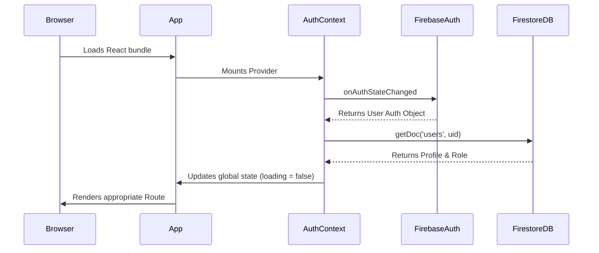

# ProofLayer System Architecture

ProofLayer is built as a modern, serverless single-page application (SPA). The architecture is designed for fast, dynamic interactions utilizing React on the frontend and Firebase for real-time data and authentication.

## 🏗️ Tech Stack

### Frontend Core
- **Framework:** React 18+
- **Build Tool:** Vite (for fast HMR and optimized production builds)
- **Routing:** React Router v6 (`react-router-dom`)
- **Styling:** Tailwind CSS integrated with pure CSS modules and global CSS variables
- **Icons:** `react-icons`

### Backend as a Service (BaaS)
- **Authentication:** Firebase Auth (Email/Password, Google OAuth)
- **Database:** Firebase Firestore (NoSQL Document Store)
- **Hosting:** Suitable for Firebase Hosting or Vercel/Netlify.

---

## 🗄️ Database Schema (Firestore)

The application utilizes a denormalized NoSQL structure inside Firestore.

### 1. `users` Collection
Stores user profile information, roles, and preferences.

```typescript
interface UserProfile {
  uid: string;                 // Matches Firebase Auth UID
  email: string;               // User's email
  displayName?: string;        // Full name
  company?: string;            // Workspace/Company name
  designation?: string;        // Job title
  role: string;                // 'user' | 'privileged_user' | 'admin'
  createdAt: string;           // ISO Timestamp
  updatedAt: string;           // ISO Timestamp
  isActive: boolean;           // For disabling accounts
}
```

### 2. `projects` Collection (Sidecar)
Organizes assets and testimonials into logical groups/workspaces.

```typescript
interface Project {
  id: string;
  companyId?: string;          // Optional organization filtering
  name: string;
  description: string;
  createdAt: Timestamp;
}
```

### 3. `assets` Collection (Sidecar)
General non-testimonial documents, media, or case studies attached to projects.

```typescript
interface Asset {
  id: string;
  projectId: string;           // Points to a specific Project
  companyId: string;           // Organization ID for security rules
  title: string;
  type: string;               // 'Document', 'Case Study', 'Video', 'Pitch Deck'
  fileName: string;           // Original name of the uploaded file
  url: string;                // External or Firebase Storage URL
  uploadedBy: string;         // User ID of the uploader
  createdAt: Timestamp;
}
```

### 4. `testimonials` Collection
Stores the live, approved testimonials that will be distributed/displayed.

```typescript
interface Testimonial {
  id: string;                  // Auto-generated Firestore ID
  author: string;              // Name of the reviewer
  content: string;             // Testimonial text
  rating?: number;             // Star rating (1-5)
  source: string;              // e.g., 'G2', 'Spreadsheet', 'Manual'
  status: string;              // 'active', 'archived', etc.
  projectId?: string;          // (Optional) Links testimonial to a Project Hub
  createdAt: Timestamp;        // Import/Creation time
  updatedAt: Timestamp;        
  approvedAt?: string;         // ISO Timestamp when approved from staging
  // ... other dynamic fields mapped from spreadsheets
}
```

### 5. `imported` Collection (Staging)
Acts as a holding pen for testimonials scraped from third-party sites before a privileged user approves them.

```typescript
interface ImportedTestimonial {
  // Same structure as Testimonial, but temporary
  // Docs are deleted from here once moved to `testimonials`
}
```

---

## 🧩 Key Architectural Components

### 1. The Context Layer (`AuthContext.jsx`)
Acts as the central nervous system for session and RBAC (Role-Based Access Control).
- Listens to Firebase `onAuthStateChanged`.
- Fetches the active profile from the `users` collection.
- Exposes authentication methods (`login`, `signup`, `signInWithGoogle`, `logout`) and current user data to the React component tree.

### 2. Smart Routing (`ProtectedRoute.jsx`)
Implements strict access control mechanisms wrapping `Route` components:
- `<PublicRoute>`: Rejects authenticated users, pushing them to the dashboard.
- `<ProtectedRoute>`: Ensures a valid auth session *and* a completed Firestore profile.
- `<RoleProtectedRoute>`, `<PrivilegedRoute>`, `<AdminRoute>`: Evaluates `AuthContext.userRole` against allowed arrays to block unauthorized access to sensitive pages like `/manage-users` or `/import`.

### 3. File Parser & Mapper (`UploadSpreadsheet` -> `MapColumns`)
To accommodate various external data shapes:
- **`papaparse` & `xlsx`**: Used client-side to parse CSVs and Excel files.
- **`sessionStorage`**: Stores parsed base64 chunks temporarily to pass them between the `/upload-spreadsheet` dropzone and the `/map-columns` UI without prop-drilling or large memory bloat in context.
- **Smart Mapper**: `utils/columnMapper.js` automatically maps natural language column headers (e.g. "Customer Name", "Review") to internal schema keys using fuzzy matching.

---

## 🔄 Sequence Diagrams

### Application Initialization



### The Distribution Architecture (Future Scope)
*Context: The inactive 'Distribute' tab points towards ProofLayer's ultimate goal to distribute reviews via Wall of Love / FOMO Popups.*


