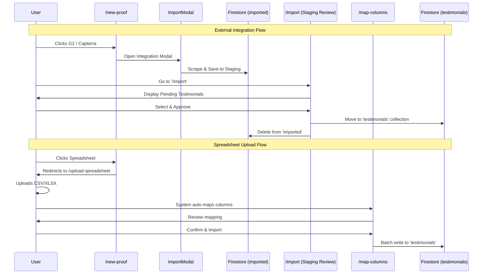

# ProofLayer Workflow & Navigation Flow

ProofLayer is a SaaS platform designed to help businesses collect, manage, and distribute customer testimonials. Businesses can connect various sources (G2, spreadsheets, manual) to consolidate their "Wall of Love" and eventually distribute these via FOMO pop-ups or integrations.

## 👥 User Profiles & Access Levels

ProofLayer employs a Role-Based Access Control (RBAC) system with three distinct roles. Access is controlled via `AuthContext` and protected route wrappers.

### 1. User
- **Capabilities:** Can view, create (manual), and edit their own testimonials. Can access the main dashboard.
- **Restrictions:** *Cannot* delete testimonials, import from external sources/spreadsheets, manage users, or access settings.
- **Best for:** General team members who only need to submit manual proofs or view existing ones.

### 2. Privileged User
- **Capabilities:** All User permissions + can delete own testimonials, import from integrations (G2, Capterra, etc.), upload spreadsheets, and access account settings.
- **Restrictions:** *Cannot* manage other users.
- **Best for:** Marketing managers or content administrators who need to sync external proofs and configure their workspace.

### 3. Admin
- **Capabilities:** Full system access. Includes all Privileged User capabilities + the ability to access the Manage Users dashboard and change roles for other users.
- **Best for:** Workspace owners and IT administrators.

---

## 🗺️ Application Navigation & Workflows

### 1. Authentication & Onboarding Flow
- **`/login` & `/signup`**: Public routes for entry. Supports Email/Password and Google OAuth.
- **`/onboarding`**: Semi-public route. If a user successfully creates an account or signs in via Google but doesn't have a fully completed Firestore profile, they are sent here to provide their Name, Company, and Designation.
- **Protected Routing**: If navigating to an authenticated route without a session, users are redirected to `/login`.

### 2. Primary Layout (Sidebar & Header)
Once authenticated, the app renders inside `AppLayout`, providing persistent navigation.

- **Collect Section:** 
  - **New Proof (`/new-proof`)**: Choose a source to add new testimonials.
  - **Import (`/import`)**: Review testimonials staging area (requires `Privileged` or `Admin`).
- **Manage Section:**
  - **Your Proofs (`/dashboard`)**: The main list of active testimonials.
  - **Users (`/manage-users`)**: View and modify user roles (requires `Admin`).
- **Share Section:**
  - **Distribute (`#`)**: Currently inactive. This tab is reserved for future features where businesses can configure their "Wall of Love" or extract FOMO pop-up code snippets to integrate testimonials into their live websites.
- **Account Section:**
  - **Settings (`/settings`)**: Personal and workspace configurations (requires `Privileged` or `Admin`).

### 3. Proof Collection Workflows

There are three ways to collect proofs in ProofLayer:

#### A. Manual Import
- **Trigger:** Clicking "Manual Import" from `/new-proof`.
- **Flow:** User navigates to `/manual-import`, fills out a form (Customer Name, Content, Rating, etc.), and saves directly to the live `testimonials` collection.

#### B. Spreadsheet Upload (`/upload-spreadsheet`)
- **Trigger:** Clicking "Upload Spreadsheet" from `/new-proof`.
- **Flow:** 
  1. User uploads a `.csv`, `.xls`, or `.xlsx` file.
  2. The file is validated (<= 5MB) and preview parsed.
  3. User is redirected to `/map-columns`.
  4. The system automatically attempts smart-mapping the spreadsheet columns to expected database fields (Name, Content, Date, Source, etc.).
  5. User finalizes the mapping and submits. 
  6. Data is batch-written to the live `testimonials` collection, and the user is redirected to the Dashboard.

#### C. External Integrations (G2, Capterra, etc.)
- **Trigger:** Clicking an integration card on `/new-proof`.
- **Flow:** 
  1. Opens the `ImportModal` for the user to input the source URL (e.g., G2 product page).
  2. The system initiates a mock-scraping service.
  3. Scraped data is pushed to a staging collection called `imported`.
  4. User navigates to `/import` to review the staged testimonials.
  5. User selects the valid proofs, clicks "Approve & Import".
  6. The selected items are moved to the active `testimonials` collection, and the rest remain or get deleted from staging.

### 4. Testimonial Management Flow
- **`/dashboard`**: Displays all active testimonials. Users can select multiple items to bulk delete (if authorized) or search by author/content.
- **Review Details (`/review/:id`)**: Clicking a specific testimonial on the dashboard opens a detailed view. Here, users can read the full text, see tags, upload company logos, trigger form invites, or execute granular actions (Edit, Approve, Delete, Share).

---

## 📊 Visual Workflows

### High Level Navigation Flow

```mermaid
graph TD
    A[Public Web] --> B{Is Authenticated?}
    B -- No --> C[Login / Signup]
    C --> B
    B -- Yes --> D{Profile Complete?}
    D -- No --> E[Onboarding]
    E --> F[Dashboard]
    D -- Yes --> F[Dashboard / Your Proofs]
    
    F --> G[Sidebar Navigation]
    
    G --> H[Collect]
    H --> H1[/new-proof]
    H --> H2[/import - Staging]
    
    G --> I[Manage]
    I --> I1[/dashboard]
    I --> I2[/manage-users - Admin Only]
    
    G --> J[Share]
    J --> J1[Distribute - FOMO / Popups]
    
    G --> K[Account]
    K --> K1[/settings]
    
    I1 --> L[/review/:id - Detailed View]
```

### Data Import Flow


